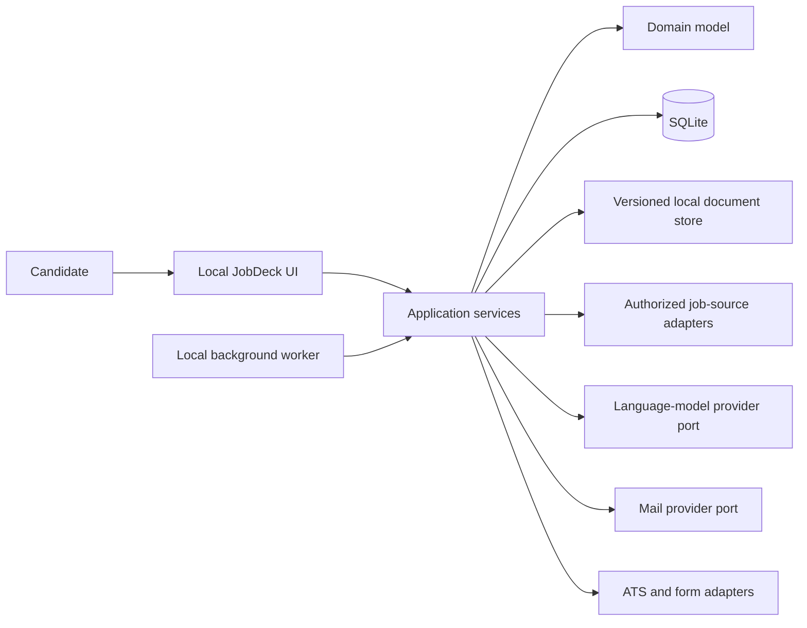

# Target architecture

The target architecture evolves the existing local application as a modular
monolith. It preserves the working NiceGUI, SQLite, source-adapter, Gmail, PDF,
and human-review foundations while introducing explicit domain ownership and
immutable evidence.

Accepted product constraints are recorded in ADRs. The component decomposition
below remains a proposal until implemented and validated.

## System context

The local operating-system account is the current security boundary. The UI
remains loopback-only. Multi-user identity, authorization, and tenant isolation
are not introduced speculatively.

## Domain modules

### Candidate

Owns the structured candidate profile, preferences, verified facts, and
versions. Experiences, education, projects, skills, languages, credentials,
work authorization, availability, compensation, and location preferences retain
field-level provenance and verification state.

Invariants:

- imported or externally extracted values begin as proposals;
- only confirmed facts are eligible for a final application;
- an application references the exact profile version used;
- a profile correction never changes historical submissions.

### Documents

Owns uploaded and generated documents, document versions, templates,
placeholder schemas, classifications, hashes, and storage metadata.

Invariants:

- stored content is immutable per version;
- templates and generated documents have explicit versions;
- rendering inputs are traceable to source document versions;
- a submission manifest names every exact document version and hash;
- untrusted parsing and HTML rendering operate behind resource and network
  restrictions appropriate to the input.

### Job catalog

Separates a canonical job from source observations. Each observation retains
the source, external identifier, retrieval time, original payload reference or
hash, adapter version, and freshness result.

A fingerprinting service expresses possible identity without silently
discarding provenance. It can represent:

- the same source item;
- the same posting observed through another source;
- a republication;
- the same company and role with uncertain identity;
- another position at the same company.

### Matching

Owns match assessments, dimensions, explanations, uncertainty, and candidate
feedback. Provider output is validated against a versioned schema before it
becomes an assessment.

Matching output distinguishes mandatory, preferred, experience, technology,
language, location, compensation, work-mode, seniority, and personal-preference
dimensions. The aggregate stores evidence references rather than only a prose
summary.

### Applications

Owns the application state machine, attempts, answers, approvals, reservations,
submitted artifacts, communications, interviews, assessments, offers, and
status history.

Invariants:

- an attempt has a persistent idempotency key;
- all channels respect one shared identity and reservation policy;
- only an approved application version is sendable;
- scheduled sending cannot alter approved content;
- unknown provider outcomes are reconciled without blind retry;
- an accepted provider result creates immutable submission evidence;
- a different role at a previously contacted company requires a recorded
  candidate confirmation rather than an unconditional block.

### Integrations and consent

Owns configured external integrations, external identifiers, processing
purposes, consent versions, rate policies, retry policies, and health state.
Domain modules depend on ports, not provider SDKs.

## Ports and adapters

### Job sources

Extend the existing `JobSource` boundary with explicit capabilities:

- search and details;
- source observation mapping;
- liveness and expiry behavior;
- documented rate limits and `Retry-After` handling;
- authorization and terms metadata;
- deterministic adapter contract fixtures.

Provider-specific conditions must remain inside an adapter or capability
registry rather than branches distributed through services and UI pages.

### Language-model providers

Introduce a provider-neutral interface around the current Anthropic
implementation. Each processing run records:

- provider and model configuration;
- operation and purpose;
- instruction and output-schema versions;
- candidate, job, and document version references or hashes;
- minimized fields sent;
- token and cost usage;
- retry result;
- consent version;
- validated output status.

Raw personal content is not duplicated into operational logs. Provider output
cannot promote a candidate fact to verified state.

### Mail

Keep Gmail as the first adapter behind a mail port. The port distinguishes
definitive rejection, accepted delivery, and uncertain transport outcomes and
returns provider identifiers required by the application attempt.

### ATS and forms

Adapters expose capabilities instead of one universal submit method:

- identify and open;
- describe fields;
- map verified values;
- fill on candidate gesture;
- preview;
- submit through an authorized API or controlled browser action;
- capture evidence.

An adapter declares sensitive fields and confirmation requirements. CAPTCHA is
always handed back to the candidate.

## Persistence and consistency

SQLite remains the primary database for the local product. Schema changes stay
additive where practical, but migrations require a verified pre-migration
backup and failure-recovery tests.

Transactions own domain state transitions. Filesystem operations use staged
writes and explicit compensation. A content-addressed document store prevents a
mutable path from changing historical evidence.

Cross-process coordination is not assumed. If the product later permits more
than one process against the same data directory, persistent leases and work
records must replace process-local locks before that mode is supported.

## Background work

The in-process scheduler remains sufficient while JobDeck is a single local
process. Work that spends money, sends externally, or mutates application state
must have a persistent attempt record, retry classification, next-attempt time,
and idempotency key. Process-local locks remain an optimization, not the
integrity boundary.

## Privacy and erasure

The data inventory must map candidate facts, documents, drafts, messages,
provider metadata, active files, removed files, SQLite auxiliary files, and
backups. Permanent erasure deletes active data and records an erasure marker
that can be reapplied after restoring an older backup. Backup retention is
finite and documented.

Encryption relies first on operating-system disk protection and owner-only file
permissions. Additional field or backup encryption should be introduced only
after defining key ownership, recovery, and the threat model.

## Evolution constraints

- Do not replace the modular monolith without measured process or scaling
  pressure.
- Do not introduce a generic plugin framework before a second concrete adapter
  demonstrates the required variation.
- Do not implement multi-user hosting by swapping SQLite alone.
- Do not introduce autonomous submission, CAPTCHA bypass, or provider-specific
  shortcuts around approval and evidence.
- Preserve compatibility with the current local data during additive migration.
